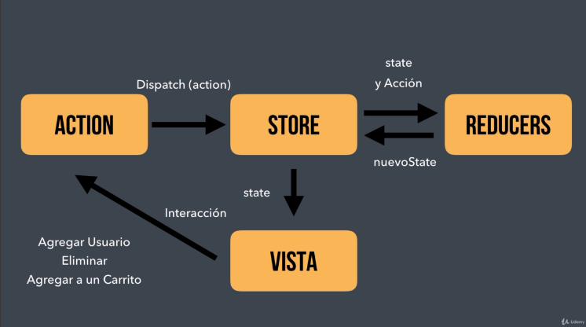

# Redux

## ¿Que es REDUX?

1. Redux te permitirá manejar el **STATE** de tus aplicaciones más fáciles conforme van craciendo.

2. Te ayuda a manejar los datos conforme a las acciones realizadas por el usuario.

## Caracteristicas de REDUX

* Solo se tiene un STATE principal
* El STATE cambia de acuerdo a lo que sucede de la interfaz de usuario
* Solo ciertas funciones cambian el STATE
* El usuario es el que utiliza estas funciones y cambia el STATE
* Solo se realiza un cambio a la vez

## Cuando utilizar REDUX

>Yes --> Si tu proyecto es grande y será mantenido ppoe varias personas, REDUX será de gran ayuda.  
>
>No --> Si tu aplicación es sencilla y pequeña no necesitas REDUX - Utiliza Hooks o Contex.  

## Terminología de REDUX

**STORE** - Contiene el STATE (1 por aplicación).

**DISPATCH** - Ejecuta una acción que actualizará el STATE.

**ACTION** - Objetos JS, tiene un TYPE y PAYLOAD (Datos).

**SUBSCRIBE** - Similar a un Event Listener para el STATE.

**REDUCER** - Funciones, saben que hacer con los Actions y el Payload.

## Ciclo de vida de REDUX

## Instalar REDUX a nuestra create-react-app

> ~~~
>  $ npm i react-redux redux redux-thunk
> ~~~